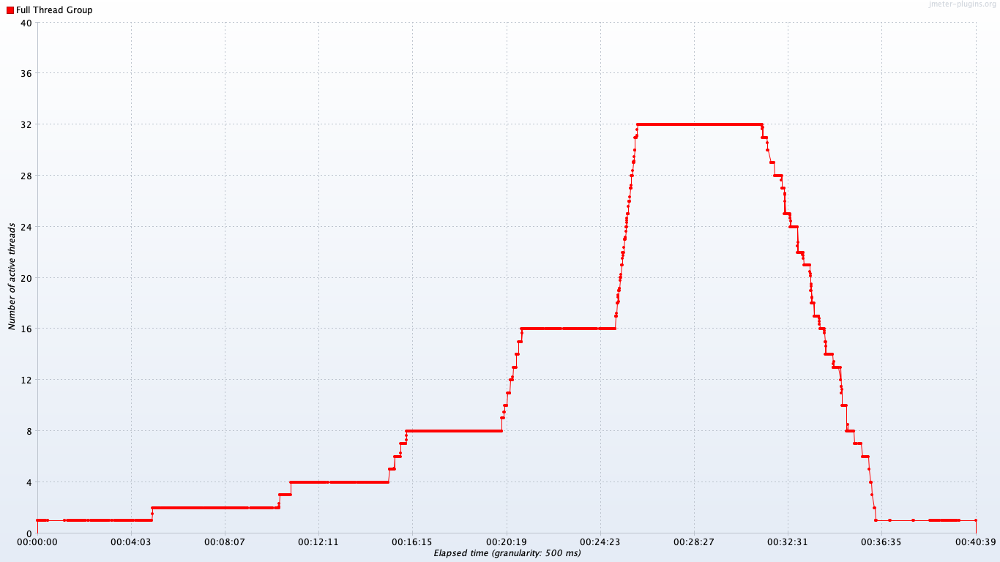

# DSpace Performance Testing

This project provides JMeter tests, scripts, and documentation for running DSpace performance tests.

Read [Sessions, transactions, and requests](doc/sessions.md) for details on the user sessions that are
modeled for these tests.

[Browse the github repository](https://github.com/cwilper/dspace-perftest) for the JMeter (jmx) test files and
raw jtl/csv test results for the tests listed below.

## Baseline results

* [DSpace 6.3](report/2019-05-31-6.3/README.md)
* [DSpace 7.0 Preview 1](report/2019-05-31-7.0.p1/README.md)

The above tests were performed on a single `m5a.large` EC2 instance (8GB RAM, 2 virtual CPUs),
running Amazon Linux 2 (similar to CentOS 7), on a single magnetic EBS volume, with Postgres 10 and
all dependent services running on the same host, all served over HTTPS using Apache. These initial tests
were intentionally performed without any tuning (so, with out-of-box settings), in order to
establish a baseline for comparison. Java processes were run with Java 8. Tomcat was launched with
a 4GB max heap size. For DSpace 7, the Angular UI was built with out of box production settings, and
was launched with PM2.

Requests were made and measurements were recorded on a separate host within the same availability zone.
To aid in remote collection of server metrics, [Perfmon Server Agent](https://github.com/undera/perfmon-agent/)
was used.

During the tests, the number of concurrent threads was doubled every five minutes, starting with
one thread for the first five minutes, peaking at 32 threads, and ramping back down to a single
thread for five minutes to end the test:

