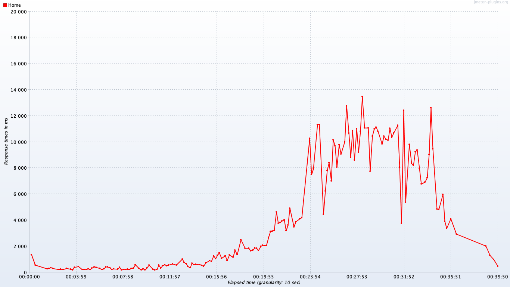
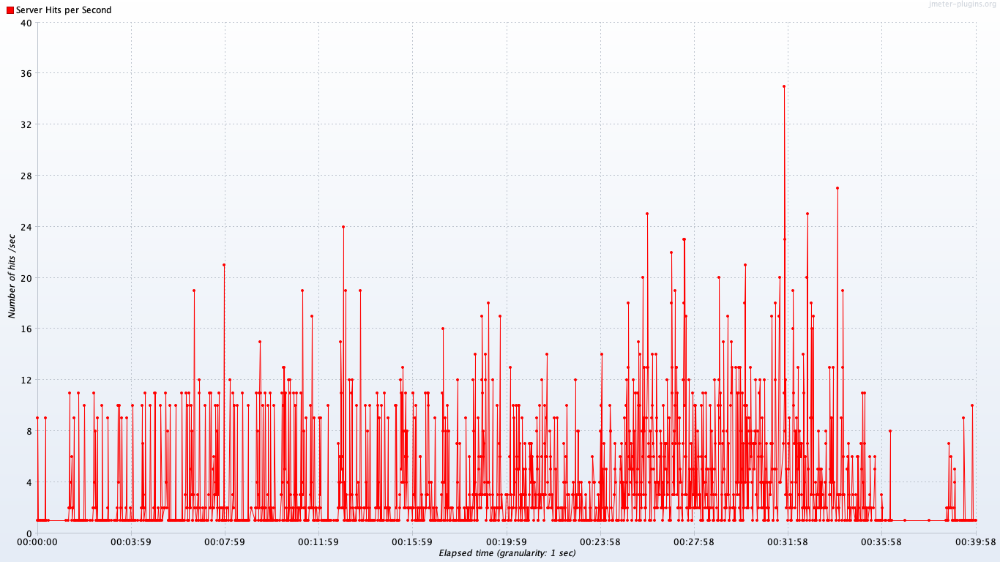
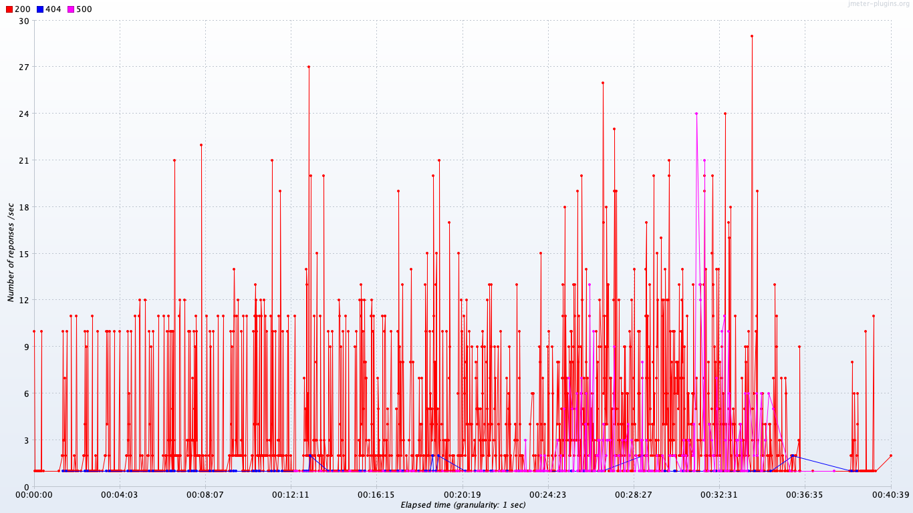
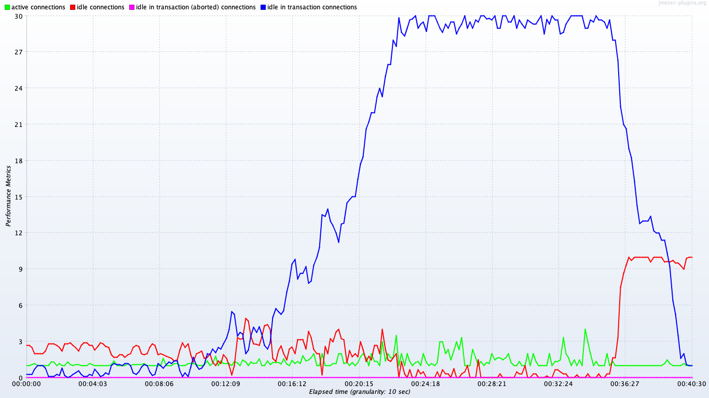
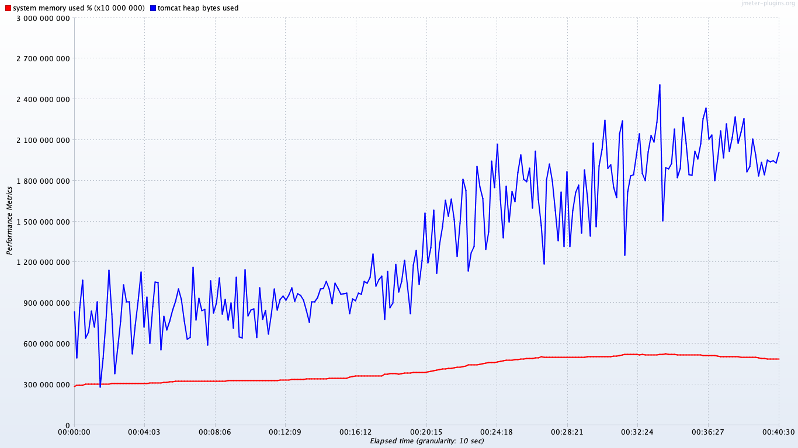

# DSpace performance test report

## Single-threaded results

Session | Pages/session | Bytes/session | Seconds/session | Transaction details
-|-|-|-|-
Big | 7 | 891KB | 5.3 | [See details](details-big)
Browse | 6 | 1.0MB | 24.5 | [See details](details-browse)
Search | 5 | 925KB | 1.8 | [See details](details-search)
Tiny | 7 | 882KB | 2.3 | [See details](details-tiny)

## Multi-threaded results

### Concurrent threads

### Homepage load time

### Overall hit rate

### Response codes

### CPU use

### Database connections

### Memory use

