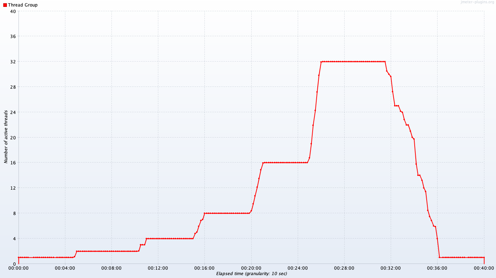
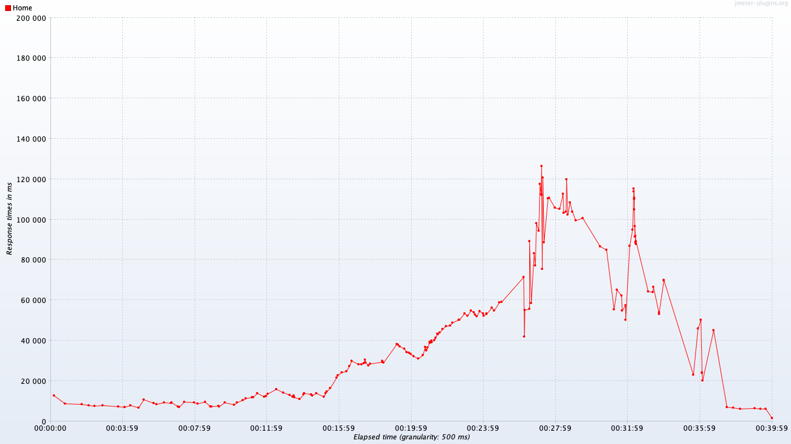
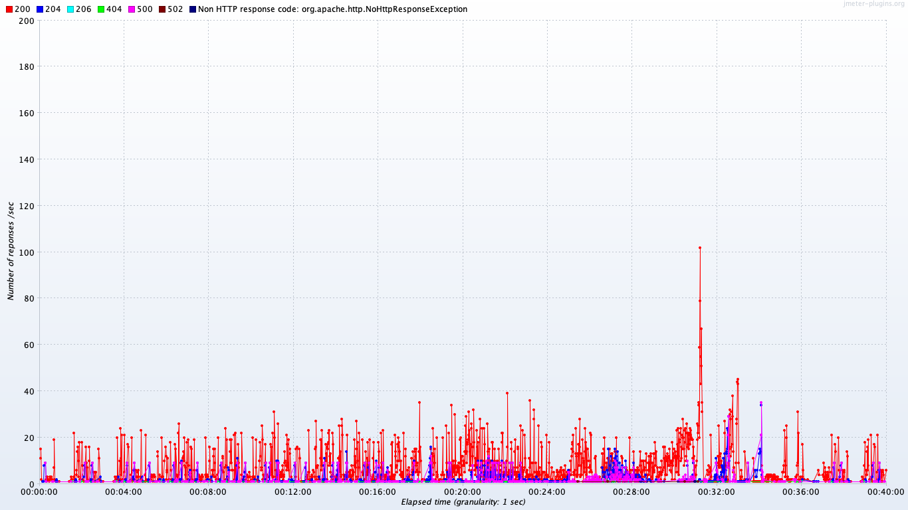
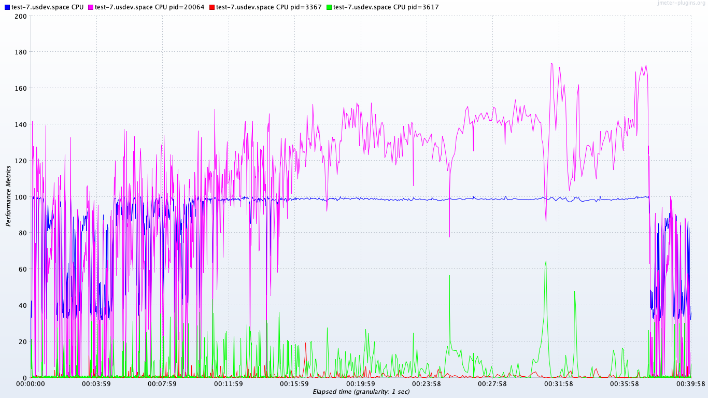
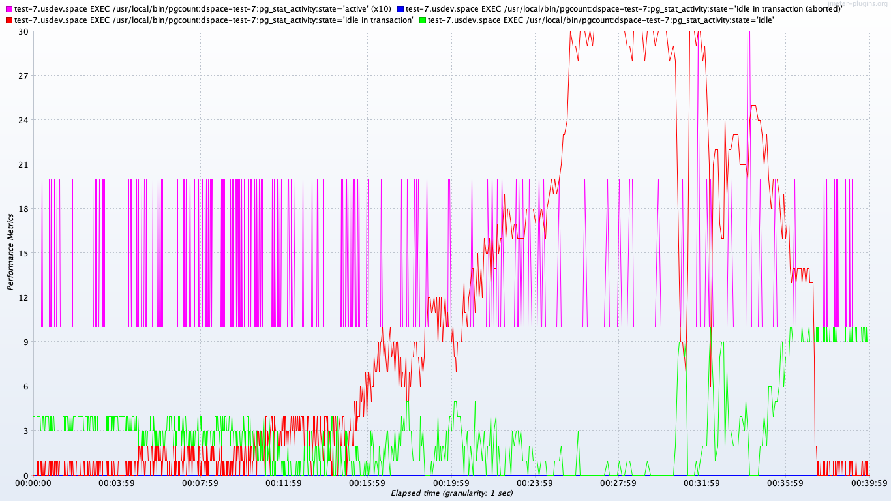
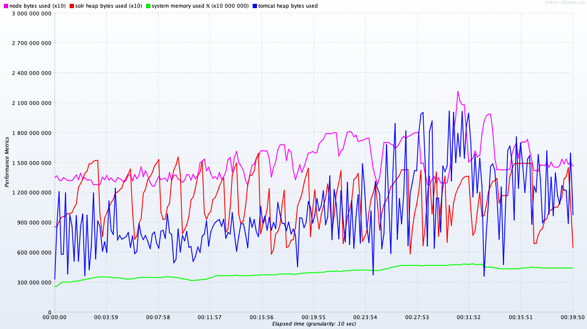

# Baseline report for DSpace 7.0 Preview 1

During this test, the number of concurrent threads was doubled every five minutes, starting with one thread
for the first five minutes, peaking at 32 threads, and ramping back down to a single thread for a few minutes
to end the test.

For detailed information about the user activities modeled in this test,
see [Sessions, transactions, and requests](../../doc/sessions).

## Single-threaded results

During the first 5 minutes of the test, a single thread was used to make all requests,
so the server only had to handle one request at a time. This put an artificially low load on the server,
while providing an average "best case" roundtrip time number per request.

**IMPORTANT: single-threaded != single-user**

The seconds/session numbers reported below were computed by adding all delays for loading
each resource for each page. A real browser would spend less time waiting for all resources
to load due to parallel loading of resources.  So, while helpful in understanding the overall
performance picture, **the seconds/session numbers do not accurately reflect expected page wait times**.

Session | Pages/session | Bytes/session | Seconds/session | Transaction details
-|-|-|-|-
Big | 7 | 4.2MB | 20.5 | [See details](details-big)
Browse | 6 | 11.6MB | 45.7 | [See details](details-browse)
Search | 5 | 5.0MB | 13.6 | [See details](details-search)
Tiny | 7 | 3.4MB | 8.9 | [See details](details-tiny)

## Test results over time

The following graphs show how certain measurements changed over the lifetime of the test.

### Homepage load time

This shows how the average time to load all home page resources, back-to-back, changed over the life of the test,
depending on how many threads were active.

### Responses/sec by status code

### CPU use

### Database connections

### Memory use

