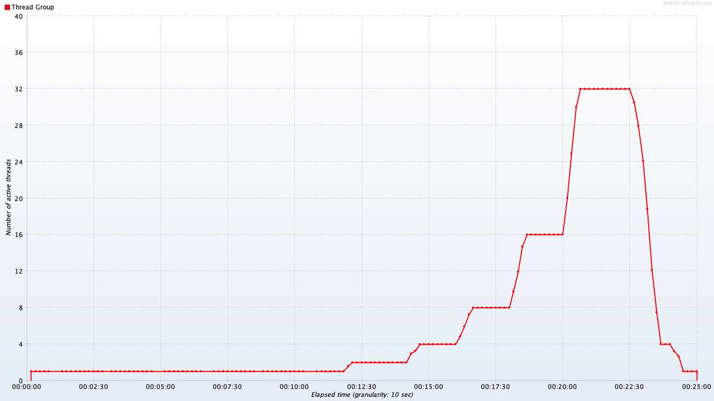
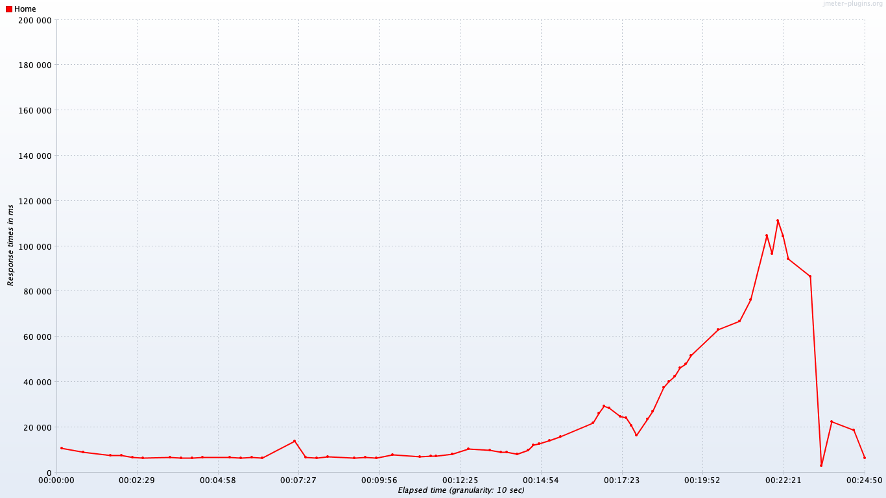
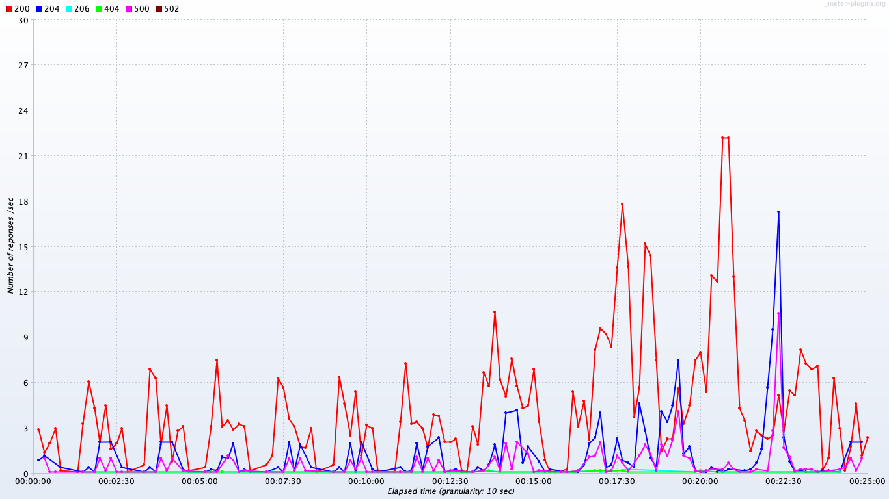
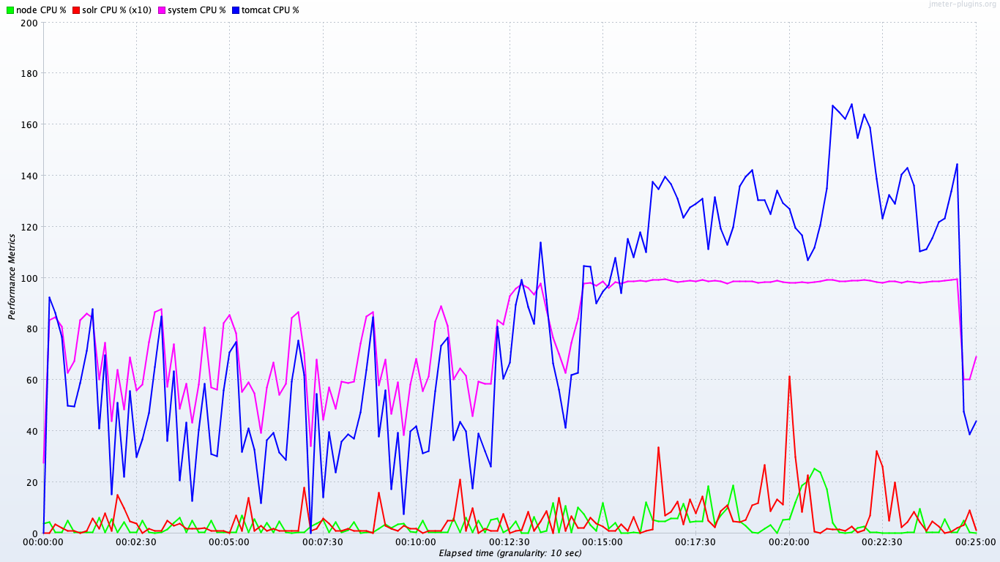
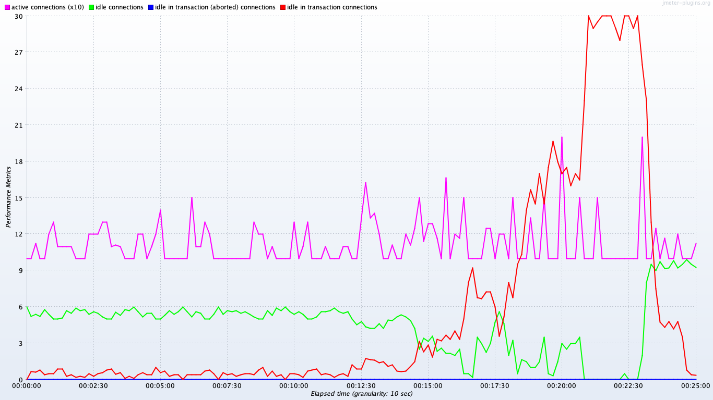
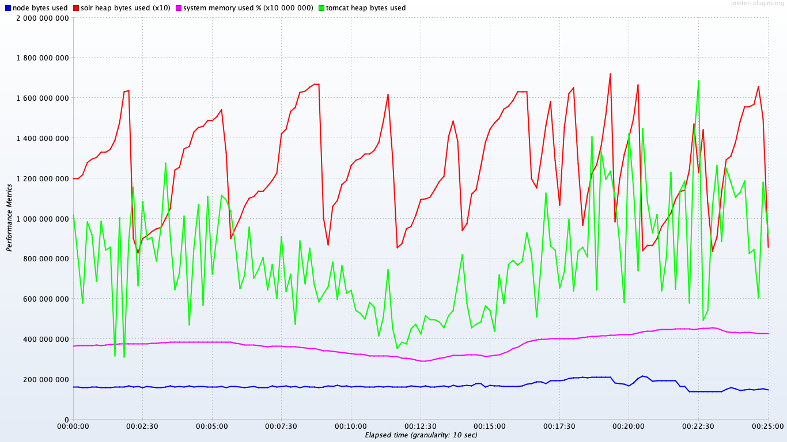

# Report for DSpace 7 Preview 1 with PR2397

During this test, the number of concurrent threads started at one, and was doubled after 12 minutes,
doubling every 2 minutes after that, peaking at 32 threads, then ramped down to a single thread for
a couple minutes to end the test.

For detailed information about the user activities modeled in this test,
see [Sessions, transactions, and requests](../../doc/sessions).

## Single-threaded results

During the first phase of the test, a single thread was used to make all requests,
so the server only had to handle one request at a time. This put an artificially low load on the server,
while providing an average "best case" roundtrip time number per request.

**IMPORTANT: single-threaded != single-user**

The seconds/session numbers reported below were computed by adding all delays for loading
each resource for each page. A real browser would spend less time waiting for all resources
to load due to parallel loading of resources.  So, while helpful in understanding the overall
performance picture, **the seconds/session numbers do not accurately reflect expected page wait times**.

Session | Pages/session | Bytes/session | Seconds/session | Transaction details
-|-|-|-|-
Big | 7 | 4.2MB | 16.68 | [See details](details-big)
Browse | 6 | 11.6MB | 40.58 | [See details](details-browse)
Search | 5 | 5.0MB | 13.06 | [See details](details-search)
Tiny | 7 | 3.4MB | 8.15 | [See details](details-tiny)

## Test results over time

The following graphs show how certain measurements changed over the lifetime of the test.

### Homepage load time

This shows how the average time to load all home page resources, back-to-back, changed over the life of the test,
depending on how many threads were active.

### Responses/sec by status code

### CPU use

### Database connections

### Memory use

